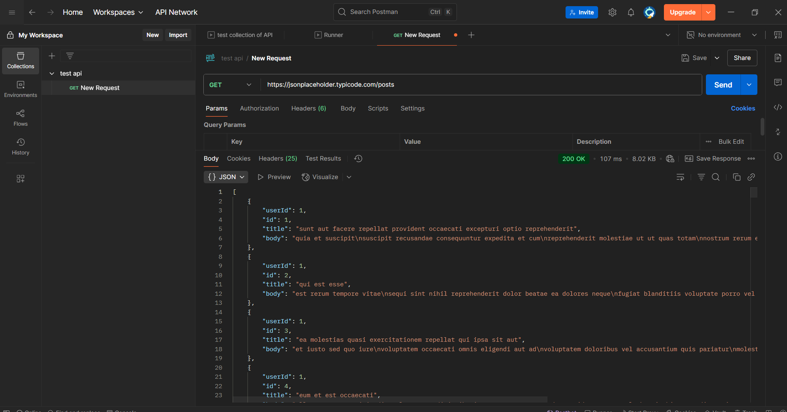
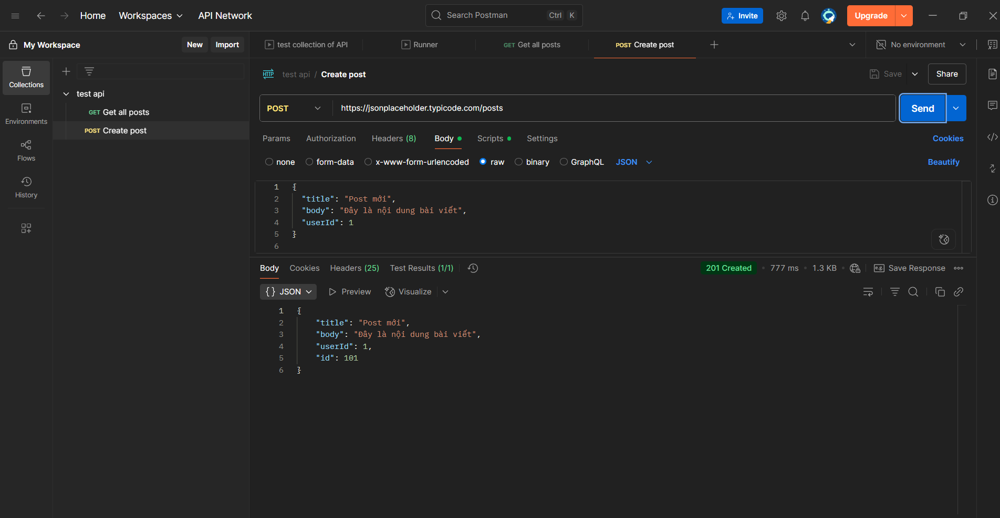
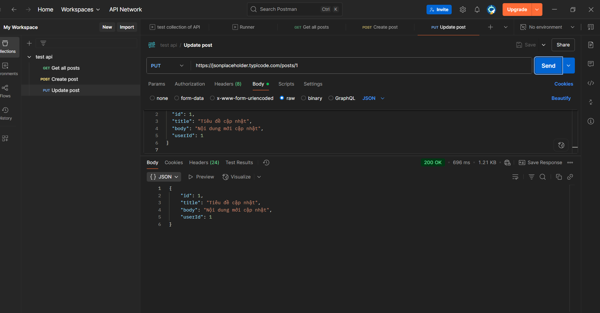
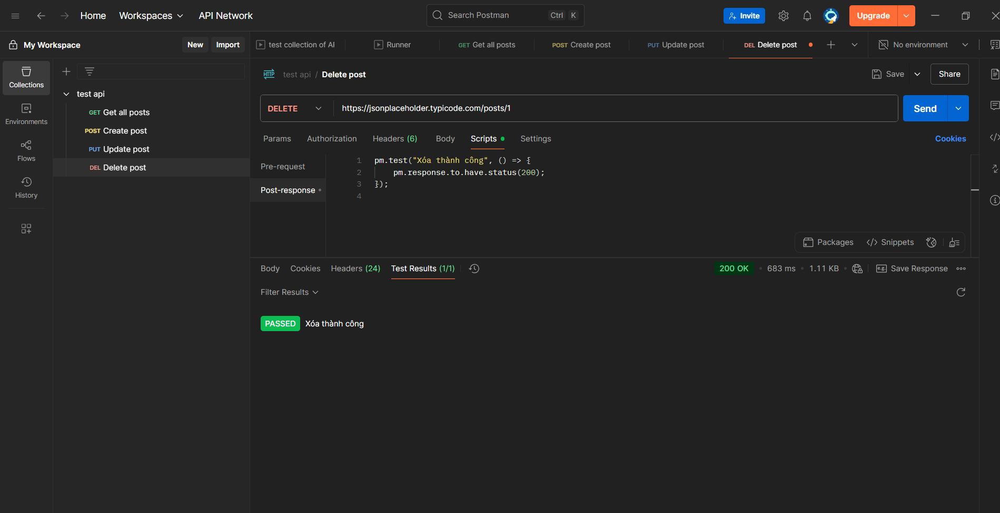

# 🛠️ Hướng dẫn kiểm thử API với Postman

Bài hướng dẫn thực hành kiểm thử API cơ bản với các phương thức HTTP:
- `GET`: Lấy danh sách bài viết
- `POST`: Thêm bài viết mới
- `PATCH`: Cập nhật một phần bài viết
- `DELETE`: Xóa bài viết

Sử dụng API giả lập từ [JSONPlaceholder](https://jsonplaceholder.typicode.com/).

## 📋 Tổng quan các request

| Phương thức | Endpoint                            | Mô tả chức năng           |
|-------------|-------------------------------------|---------------------------|
| `GET`       | `/posts`                            | Lấy toàn bộ bài viết      |
| `POST`      | `/posts`                            | Tạo bài viết mới          |
| `PATCH`     | `/posts/1`                          | Cập nhật bài viết số 1    |
| `DELETE`    | `/posts/1`                          | Xóa bài viết số 1         |

### 📖 GET /posts – Lấy danh sách bài viết



🔎 **Mục đích**: Truy xuất danh sách tất cả bài viết trong hệ thống.

- **Phương thức**: GET  
- **URL**: `https://jsonplaceholder.typicode.com/posts`  
- **Phản hồi**: Một mảng JSON chứa danh sách bài viết.

🧪 **Kiểm thử**: Xác nhận mã trạng thái phản hồi là `200 OK`.

### ➕ POST /posts – Tạo bài viết mới



🔎 **Mục đích**: Gửi dữ liệu để tạo một bài viết mới trên server.

- **Phương thức**: POST  
- **URL**: `https://jsonplaceholder.typicode.com/posts`  
- **Body (JSON)**:
```json
{
  "title": "Bài viết mẫu",
  "body": "Đây là nội dung thử nghiệm",
  "userId": 1
}
```

### 🔄 PATCH /posts/1 – Cập nhật một phần bài viết



🔎 **Mục đích**: Cập nhật một phần thông tin của bài viết với ID xác định.

- **Phương thức**: PATCH  
- **URL**: `https://jsonplaceholder.typicode.com/posts/1`  
- **Body (JSON)**:
```json
{
  "title": "Tiêu đề được chỉnh sửa"
}
```

### 🗑️ DELETE /posts/1 – Xóa bài viết



🔎 **Mục đích**: Xóa bài viết với ID cụ thể khỏi hệ thống (API giả lập).

- **Phương thức**: DELETE  
- **URL**: `https://jsonplaceholder.typicode.com/posts/1`  
- **Request**: Không cần body.  
- **Response**: Mã trạng thái `200 OK` biểu thị xóa thành công.

🧪 **Test script trong Postman**:
```javascript
pm.test("Xóa bài viết thành công", () => {
    pm.response.to.have.status(200);
});
```

## 📊 Kết luận

✅ Qua bài thực hành này, bạn đã nắm được các kỹ năng cơ bản khi làm việc với API:

- Thực hiện các yêu cầu HTTP: `GET`, `POST`, `PATCH`, `DELETE`
- Sử dụng Postman để kiểm thử và xác nhận phản hồi từ server
- Viết script kiểm thử đơn giản trong Postman để kiểm tra kết quả
- Làm quen với cách gửi và nhận dữ liệu JSON qua API RESTful

🌟 Sử dụng API giả lập như `jsonplaceholder.typicode.com` giúp thực hành an toàn, không ảnh hưởng đến dữ liệu thực tế.
